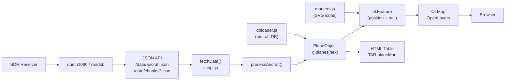
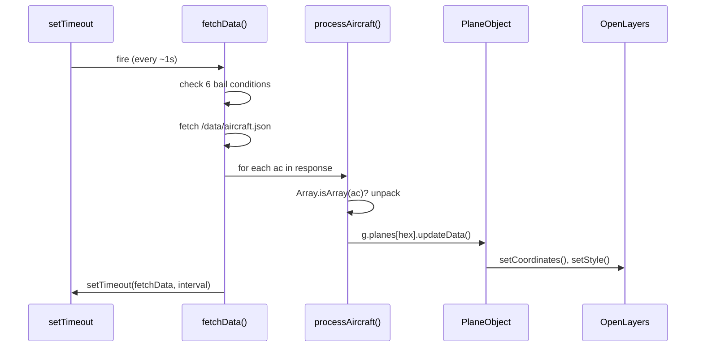
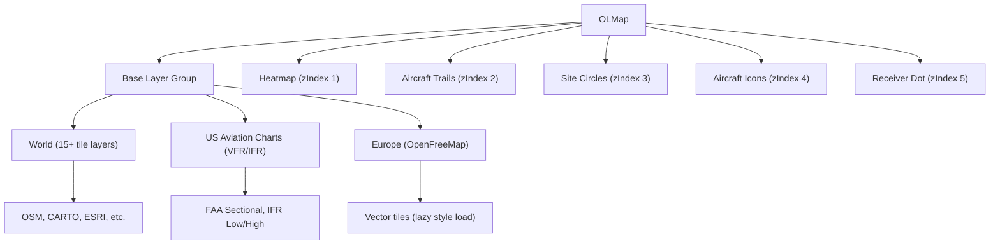
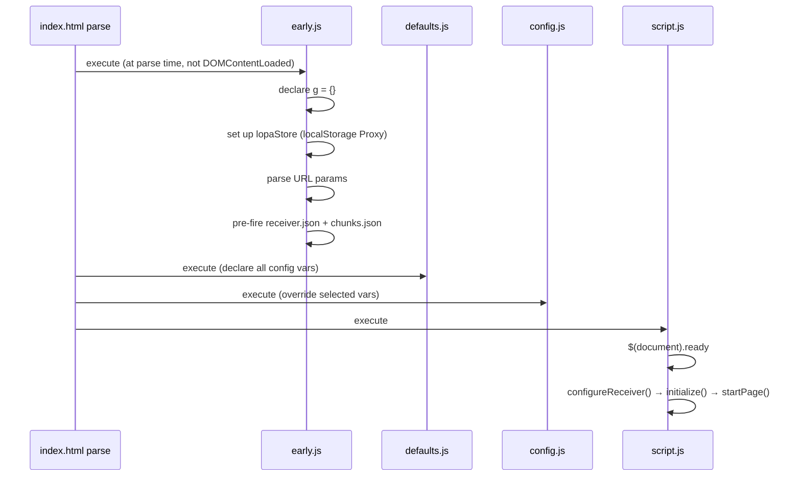

# adsb-map Architecture Analysis

> **Purpose of this report**: Understand the codebase before modernizing it. Covers what the code does, how it's designed, where the skeletons are, and a concrete path forward.

---

## What Is This?

adsb-map is a fork of [tar1090](https://github.com/wiedehopf/tar1090) — a browser-based web UI for displaying ADS-B aircraft tracking data. ADS-B (Automatic Dependent Surveillance-Broadcast) is the protocol aircraft use to broadcast their own position, altitude, speed, and identity on 1090 MHz. A local receiver (a Raspberry Pi with an RTL-SDR dongle and software like `dump1090-fa` or `readsb`) decodes those broadcasts and exposes them as JSON. adsb-map is the frontend that reads that JSON and shows it on a map in real time.

The upstream project is used by major aggregator sites (adsb.lol, globe.adsbexchange.com, globe.airplanes.live, globe.adsb.fi). This fork's goal is to take that proven functional core and modernize the code and UI.

---

## Project at a Glance

**Stack**: Pure vanilla JS, OpenLayers 8 (map), jQuery 3 + jQuery UI 1.13 (DOM/interactions). No framework, no bundler, no TypeScript. All files loaded via `<script>` tags in a fixed order in `index.html`.

**Size**: ~20K lines of own code (excluding third-party libraries).

| Layer | Files | Lines |
|-------|-------|-------|
| App orchestrator | `script.js` | 9,269 |
| Aircraft model | `planeObject.js` | 3,153 |
| Map icons | `markers.js` | 1,494 |
| Map layers | `layers.js` | 973 |
| Boot/init | `early.js` | 940 |
| Formatting | `formatter.js` | 720 |
| Config | `defaults.js`, `config.js` | 907 |
| Data enrichment | `dbloader.js`, `registrations.js`, `flags.js` | 726 |
| Geo math | `geomag2020.js` | 361 |
| Worker | `jsonWorker.js` | 15 |

**How data flows:**



---

## The Main Event: script.js

script.js is the central nervous system — 9,269 lines, 205 top-level functions, all in `window` scope (with two partial exceptions: `TAR.planeMan` for the table and `TAR.utils` for geometry helpers). Understanding it is understanding the app.

### Global State

Two tiers:

**The `g` object** (declared in `early.js`, populated in `script.js`):
| Field | Role |
|-------|------|
| `g.planes` | `{ [hex]: PlaneObject }` — the aircraft registry |
| `g.planesOrdered` | sorted array for table rendering |
| `g.selected_icao` | ICAO hex of selected aircraft |
| `g.history_*` | history playback state |

`g` exists for an interesting reason: OpenLayers was holding references to aircraft through OL feature properties, preventing garbage collection. Moving shared state into a single namespace object let `releaseMem()` nuke it cleanly. It's a workaround for an OL memory leak, not a principled design.

**Raw window globals** (~40 scalars):
- `OLMap` — the OpenLayers map instance
- `SelectedPlane` — currently selected PlaneObject
- `timers` — dict of all `setTimeout` handles
- `toggles` — dict of all Toggle instances
- `loStore` — localStorage proxy (defined in `early.js`)

### The Polling Loop



The loop self-reschedules via `setTimeout` rather than `setInterval`. This prevents concurrent fetch stacking when the server is slow — `setInterval` would fire the next call even if the previous one hadn't returned. The six bail conditions (tab hidden, map animating, fetch in-flight, history mode active, etc.) are a mature response to years of edge cases in production.

After each fetch: `fetchDone() → checkMovement() → refresh() → TAR.planeMan.refresh()`. There's no reactive framework — everything is imperative. The table dirty-checks each cell and swaps the whole `<tbody>` via `replaceChild`. An 850ms `everySecond` heartbeat runs independently to update age indicators.

### The Wire Format Problem

Aircraft data from the decoder can arrive in two formats:

```js
// Compact array format (history chunks)
["a1b2c3", 45.12, -93.45, 35000, 420, ...]

// Object format (live data)
{ hex: "a1b2c3", lat: 45.12, lon: -93.45, alt_baro: 35000, speed: 420 }
```

The `Array.isArray(ac)` check happens at `processAircraft()` but the branching propagates through approximately 15 downstream functions. Every function that touches aircraft data has to handle both shapes. This is the #1 maintainability tax on the codebase.

### Natural Module Seams

Despite being a monolith, `script.js` has clear internal responsibilities. Eight natural module boundaries are visible:

| Module | Current location | Lines (approx.) |
|--------|-----------------|-----------------|
| `FetchCoordinator` | `fetchData()` and helpers | ~400 |
| `HistoryPlayer` | `loadHistory()`, `loadChunk()`, history state | ~600 |
| `SelectionManager` | `selectPlane()`, `deselectAll()`, `selPlanes` dict | ~300 |
| `SettingsManager` | `Toggle` class, `loStore`, settings init | ~400 |
| `MapController` | `OLMap` init, viewport, zoom events | ~500 |
| `TableManager` | `TAR.planeMan.*` (already partially extracted) | ~800 |
| `TraceManager` | pTracks loading, trace overlay | ~400 |
| `DataIngestion` | Wire format normalization | ~200 |

---

## The Aircraft Model: PlaneObject

`PlaneObject` is a prototype-based constructor (pre-ES6 style). Each tracked aircraft gets one instance. It holds all data about a plane and owns the OpenLayers features that represent it visually.

### Data Fields

~60+ fields in two categories:

**Identity** (set once, rarely change):
- `hex` — ICAO 24-bit address (primary key, always present)
- `registration` — tail number (N12345, G-ABCD, etc.)
- `icaotype` — ICAO type code (B737, A320, etc.)
- `flight` — callsign (AAL123, UAL456)
- `operator` — airline name
- `country` — derived from ICAO block range

**Volatile flight data** (updated every tick, resettable via `setNull()`):
- `lat`, `lon` — current position
- `alt_baro`, `alt_geom` — barometric and geometric altitude
- `speed`, `track`, `vert_rate` — velocity
- `squawk`, `emergency` — transponder codes
- `seen`, `seen_pos` — seconds since last update / last position

`setNull()` is a thoughtful design: it resets all volatile fields without destroying the object or its OpenLayers features. When a plane disappears and reappears (a new flight leg), the same PlaneObject is reused. This avoids the visual glitch of the marker popping in and out, and avoids the GC cost of destroying and recreating OL features.

### The Update Lifecycle

```
updateData(now, last, data, init)
  ├── if Array.isArray(data): unpack compact format → object
  ├── updatePositionData(lat, lon, nic, rc)
  │     └── validate position quality (NIC/RC fields)
  ├── updateTrack(now, lat, lon)
  │     └── append to track_linesegs or start new segment
  ├── updateMarker(now)
  │     └── recalculate color, icon style
  └── (if trace visible): schedule updateLines()
```

**Altitude sanity filter**: Rate of change > 12,000 fpm is stored in `bad_alt` rather than silently rejected. The suspect reading is preserved for debugging without being displayed — a good call for a diagnostic tool.

**Stale timeouts by source**:
| Source | Timeout |
|--------|---------|
| ADS-B / MLAT | 15 seconds |
| Ground vehicles | 30 seconds |
| ADS-C (satellite) | 120 seconds |

These differ because ADS-B updates every second, while ADS-C (used for oceanic flights via satellite) may update only every 2 minutes.

### Track History

Track history lives in `track_linesegs`: an array of segment objects, each containing an `ol.geom.LineString` of projected coordinates. The key decisions:

- **New segment triggers**: position gap > 30s, leg change (new callsign/squawk), or antimeridian crossing (180° longitude wrap-around)
- **Great-circle interpolation**: for segments > ~200km, intermediate points are computed via `makeCircle()` so the trail curves correctly on the sphere rather than cutting across it
- **Elastic feature**: an `elastic_feature` connects the last committed track point to the live position, giving smooth movement even when position updates are sparse

### The Coupling Problem

`PlaneObject` directly creates and owns OpenLayers objects:
- `ol.layer.Vector` — the trail layer
- `ol.source.Vector` — the trail data source
- `ol.Feature` — the position marker feature

This is the biggest testability problem in the codebase. You cannot instantiate a `PlaneObject` without a live OpenLayers map in the browser. There is no way to unit test the data model in isolation.

The natural split for modernization:

```
PlaneModel          PlaneRenderer
─────────           ─────────────
hex, lat, lon  →→→  ol.Feature
track history  →→→  ol.layer.Vector
altitude       →→→  icon style
updateData()        updateGeometry()
```

---

## Map Rendering: markers.js + layers.js

### How Aircraft Icons Work

`markers.js` is primarily a `shapes` object: ~100 aircraft silhouettes stored as SVG path descriptors in JavaScript (not files on disk). A 10-step waterfall selects the right shape for each aircraft:

```
1. Is it an AIS vessel (ship)?
2. Is a holiday mode active?
3. Exact type designator match? (TypeDesignatorIcons, ~400 entries)
4. Type description + wake turbulence category?
5. Type description only?
6. ADS-B category code? (A1–A7, B1–B7, C1–C7)
7. Large/heavy/special category fallback
8. Generic aircraft fallback
9. Generic shape
10. Default dot
```

`svgShapeToURI()` builds an SVG string from the path descriptor and base64-encodes it as a data URI. This is passed to `new ol.style.Icon({ src: dataURI })`. An `iconCache` keyed by `{shape}:{fillColor}:{strokeColor}` prevents regenerating identical icons.

**The blank-on-first-render issue**: SVG-as-data-URI means the browser must decode the icon from a string synchronously on first use. Until decoded, the feature renders blank. The WebGL sprite sheet approach (`ol.layer.WebGLPoints`) was prototyped to fix this — it would pre-render all shapes into a single texture atlas — but was abandoned with this guard left in place:

```js
if (true || TrackedAircraftPositions < 200) {
    // SVG path (always runs, forever)
}
```

### Layer Architecture



25+ tile providers total. OpenFreeMap vector-tile styles are lazily loaded via an `onVisible` callback — the style JSON is only fetched if the user actually selects that layer. This is a good performance decision.

**Dead code**: `tileTransition: onMobile ? 0 : 0` — both branches are 0, so the desktop tile fade-in is permanently disabled. Likely a regression from a merge.

---

## Support Layer: Init, Config, Utilities

### Boot Sequence



`early.js` runs at parse time — before `$(document).ready`. This is intentional: it pre-fires HTTP requests for `receiver.json` and the first history chunk while the rest of the page is still loading, shaving latency off the initial load.

The startup is sequenced via a jQuery Deferred chain: `historyLoaded` and `zstdDefer` (the zstd decoder worker initializing) must both resolve before `startPage()` runs. This is the 2018 equivalent of `await Promise.all([historyLoad, zstdInit])`.

### Config System: Two-File Override

```js
// defaults.js — declares everything with sensible defaults
let ShowAltitudeChart = true;
let mapCenterLat = 45.0;
let metric = false;
// ... 100+ variables

// config.js — reassigns the ones you want to change
ShowAltitudeChart = false;   // overrides
// mapCenterLat = ...        // commented out = keep default
```

Dead simple. Works. But `config.js` must be loaded after `defaults.js` — that dependency is enforced only by `<script>` tag order in `index.html`. There's no schema, no type checking, no validation. A typo silently uses the default.

### Formatter

`formatter.js` is stateless free functions. Input is always in ADS-B native units (feet, knots, nautical miles). Output is converted to whichever of three systems is configured:

| Setting | Altitude | Speed | Distance |
|---------|----------|-------|----------|
| Imperial | feet | knots | nmi |
| Metric | meters | km/h | km |
| Mixed | feet | km/h | km |

The altitude formatter appends a climb/descent glyph (▲/▼) and uses ` ` (figure space) for table column alignment — a small detail that makes the table much more readable.

Oddity: `wqi()`, a binary data decoder, lives at the bottom of `formatter.js`. It has nothing to do with formatting. Should be in `dbloader.js`.

### dbloader.js — Hierarchical Sharded JSON

Despite the README referencing `aircraft.csv.gz`, the actual runtime lookup uses sharded JSON — the ICAO hex is split into prefix characters, with each level having a `children` array to recurse into. One HTTP request at a time, sequenced by the custom `Promise.unwrapped()` polyfill.

`Promise.unwrapped()` is a hand-rolled `Promise.withResolvers()` — create a promise and expose its `resolve`/`reject` externally. ES2024 adds this natively as `Promise.withResolvers()`. Swappable once the browser target allows it.

### jsonWorker.js — Ready but Disabled

```js
// jsonWorker.js — all 15 lines
self.onmessage = function(e) {
    fetch(e.data.url)
        .then(r => r.json())
        .then(data => self.postMessage({ success: true, data }))
        .catch(err => self.postMessage({ success: false, error: err.message }));
};
```

Fully functional. `script.js` checks `g.jWorkers > 0` before using the worker; `early.js` sets `g.jWorkers = 0`. The infrastructure is complete. Enabling it (`g.jWorkers = 2`) would move JSON parsing off the main thread, reducing jank at 500+ planes.

### geomag2020.js — Expired

Embeds the World Magnetic Model 2020 spherical harmonic coefficients to compute magnetic declination at any lat/lon. Used only in the selected-aircraft detail panel. The WMM-2020 coefficients were valid through 2025 — the model is now running past its validity window. Needs updating to WMM-2025.

---

## Honest Assessment

### What's Genuinely Good

**The polling loop is battle-tested.** Self-rescheduling `setTimeout` with multiple bail conditions is the right pattern for a real-time data feed. `setInterval` would stack concurrent fetches when the server is slow — this approach prevents that.

**`PlaneObject.setNull()` is elegant.** Resetting volatile state without destroying the object or its OL features handles the "plane disappears and reappears between legs" case correctly without visual glitches or GC pressure.

**Track segmentation handles the hard cases.** Antimeridian crossing, flight leg detection, and great-circle interpolation for long segments are all non-obvious, and all implemented correctly.

**The icon waterfall is thorough.** Ten fallback levels and 400+ type designator entries give every aircraft a reasonable icon — from a specific B737 silhouette down to a generic "large plane" dot.

**Lazy tile style loading.** Only fetching vector-tile style JSON when the user actually selects that layer is a thoughtful optimization for a map with 25+ providers.

### What's Genuinely Problematic

**The dual wire format** is the #1 maintainability problem. Array vs. object branching at the ingestion boundary propagates defensive `Array.isArray()` checks through ~15 functions. Any change to how data is processed requires touching both branches.

**205 window globals.** Everything is in `window` scope. There's no way to know what's used where without searching the whole codebase. Name collision risk is real. Tree-shaking is impossible.

**PlaneObject owns OL objects.** Testing the aircraft data model requires a live browser with OpenLayers. There are no unit tests and there can't be until this coupling is broken.

**The WebGL path was abandoned mid-flight.** `if (true || TrackedAircraftPositions < 200)` is the clearest sign of incomplete work in the codebase. The SVG-as-data-URI path has a first-render blank issue that was never fixed.

**jsonWorker.js is disabled.** The fix for main-thread JSON parse jank is written and tested — it's just turned off.

**geomag2020.js is past its validity date.** Magnetic declination will be increasingly wrong as time passes.

**Load order is the only module system.** `defaults.js` before `config.js`. `early.js` before `script.js`. `layers.js` and `markers.js` before `script.js`. One wrong `<script>` tag order and the app silently breaks.

---

## Modernization Roadmap

The goal is to modernize the code and UI without losing what works. Here's a phased approach that de-risks each step.

### Phase 1: Quick wins — no architecture changes required

These changes are safe, isolated, and immediately valuable:

| Change | File | Risk |
|--------|------|------|
| Enable jsonWorker (`g.jWorkers = 2`) | `early.js` | Low — infrastructure already written |
| Update to WMM-2025 coefficients | `geomag2020.js` | Low — data file replacement |
| Move `wqi()` to `dbloader.js` | `formatter.js`, `dbloader.js` | Low — pure refactor |
| Replace `Promise.unwrapped()` with `Promise.withResolvers()` | `dbloader.js` | Low — same semantics |
| Fix `tileTransition: onMobile ? 0 : 0` | `layers.js` | Low — bug fix |
| Remove or resolve `if (true || ...)` in markers.js | `markers.js` | Medium — needs WebGL testing |

### Phase 2: Add a build step

The biggest single unlock is adding a bundler. Without one, you have no modules, no TypeScript, no tree-shaking, and no way to enforce load order. **Vite** is the right choice — it supports a no-framework mode, has fast HMR for development, and can target modern browsers.

Approach: add Vite as a dev dependency, configure it to bundle the existing JS files without changing the runtime behavior. Keep `index.html` as the entry point. This is additive — you're not rewriting anything yet, just adding build infrastructure.

**What this unlocks immediately**:
- `import` / `export` to replace load-order-enforced globals
- TypeScript (optional but highly recommended for a codebase this large)
- ESLint to catch the kind of typos that currently fail silently

### Phase 3: Normalize the wire format

Create a `normalizeAircraft(ac)` function at the `processAircraft` boundary:

```js
function normalizeAircraft(ac) {
    if (!Array.isArray(ac)) return ac;
    return {
        hex: ac[0], lat: ac[1], lon: ac[2],
        alt_baro: ac[3], speed: ac[4],
        // ... complete mapping
    };
}
```

Call it once at the top of `processAircraft`. Delete all `Array.isArray` checks downstream. This is a high-leverage change: one function eliminates branching across 15 call sites.

### Phase 4: Extract PlaneModel from PlaneObject

The most architecturally significant change. The goal is a `PlaneModel` with no OpenLayers dependency:

```js
class PlaneModel {
    constructor(hex) { /* pure data */ }
    updateData(data) { /* no OL calls */ }
    get markerColor() { /* computed from altitude */ }
    get isStale() { /* computed from seen */ }
}

class PlaneRenderer {
    constructor(model, map) {
        this.model = model;
        this.feature = new ol.Feature();
        this.layer = new ol.layer.Vector({ source: new ol.source.Vector() });
        map.addLayer(this.layer);
    }
    sync() {
        this.feature.setGeometry(new ol.geom.Point([this.model.lon, this.model.lat]));
        this.feature.setStyle(getIconStyle(this.model.markerColor, this.model.iconShape));
    }
}
```

This makes `PlaneModel` fully unit-testable in Node.js. It also creates a clear seam for future rendering changes (WebGL, Canvas, SVG overlay) without touching the data model.

### Phase 5: UI Modernization

Once Phase 2-4 are complete (build step + clean data layer), the UI can be approached as a standalone problem:

- **Replace jQuery DOM manipulation** with native APIs (`document.querySelector`, `addEventListener`). jQuery is ~30KB gzipped and adds complexity for operations that are now native.
- **Replace the `<tbody>` swap pattern** with a virtual DOM table. At 500+ planes, swapping the whole tbody on every tick is measurable on low-end devices. [TanStack Virtual](https://tanstack.com/virtual) or a simple `<canvas>`-based list would handle 1000 rows at 60fps.
- **Use CSS custom properties** instead of JS-driven style mutation for theme/color changes.
- **Consider a lightweight reactive layer** (Preact signals, Solid.js signals, or Vue's reactivity package standalone) for the sidebar panel. Not a full rewrite — just the stateful UI bits.

### What NOT to Rewrite First

**Don't touch the OpenLayers integration first.** The map layer system (layers.js), the tile providers, and the layer switcher are complex and mostly correct. Breaking them early kills the map while you're trying to fix the code.

**Don't replace OpenLayers.** There's no meaningful reason to switch to Mapbox GL or Leaflet. OL's vector rendering handles 1000+ aircraft features efficiently, and the existing layer system is already deep. Switching would rewrite the hardest part of the codebase for no gain.

**Don't rewrite in a framework before establishing module boundaries.** Adding React before normalizing globals means you'll be fighting React's data model and the existing globals simultaneously.

---

## Summary

adsb-map is a mature, battle-tested ADS-B frontend with a decade of edge cases baked in. The core algorithms (polling, track segmentation, icon waterfall, staleness handling) are correct and thoughtful. What it lacks is structure — 205 globals, a 9K-line monolith, and no module system mean the correct code is hard to change and impossible to test.

The path forward isn't a rewrite — it's a series of seam-finding operations:
1. Add a build step to enforce load order and enable imports
2. Normalize the wire format to eliminate dual-path branching
3. Separate PlaneModel from PlaneRenderer to enable testing
4. Then modernize the UI from a stable foundation

The bones are good. The modernization challenge is organizational, not algorithmic.
