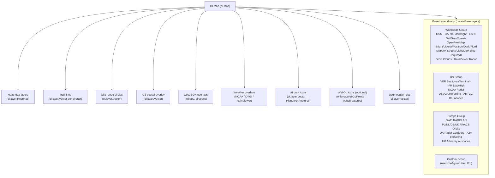

# Module 06: Map Rendering Layer — markers.js & layers.js

With the aircraft data model established in `planeObject.js` — where each tracked aircraft carries decoded ADS-B fields such as position, altitude, speed, heading, type designator, and ICAO address — the next question is how that raw data becomes something visible on screen. That translation is split across two files: `markers.js` defines what each aircraft icon looks like and how it is styled, while `layers.js` constructs the OpenLayers map itself, registers every tile provider, and stacks the overlay layers in which those icons appear.

---

## 1. How OpenLayers Is Used: Feature Layers vs. Image Layers

The application uses OpenLayers 8.x (bundled at `html/libs/`) with a strict separation between **base tile layers** (raster and vector-tile sources for the map background) and **vector feature layers** where the aircraft live.

Aircraft are represented as `ol.Feature` objects stored in two parallel `ol.source.Vector` instances declared in `script.js`:

```js
let PlaneIconFeatures = new ol.source.Vector();   // standard canvas-rendered icons
let webglFeatures     = new ol.source.Vector();   // WebGL-rendered icons (optional)
```

The corresponding display layers (`iconLayer`, `webglLayer`) are created during map initialization in `script.js → ol_map_init()`. The icon layer uses `ol.layer.Vector` with a style function; the WebGL layer uses `ol.layer.WebGLPoints` (or similar). The two are mutually exclusive at runtime: when WebGL is active, the plain vector layer is bypassed.

Aircraft flight trails are separate `ol.Feature` line strings collected into `trailGroup` (`ol.Collection`). Site range circles, the user location dot, and heat-map features each have their own dedicated `ol.source.Vector` and `ol.layer.Vector`. Nothing is drawn to a raw `<canvas>` by hand — all rendering goes through the OpenLayers style pipeline.

---

## 2. Marker Icon Generation — the SVG Path System

### 2a. The `shapes` dictionary (markers.js L4–L733)

The entire first 730 lines of `markers.js` is a single object literal called `shapes`. Each key is a short aircraft-type code (e.g. `'a319'`, `'b738'`, `'cessna'`, `'balloon'`). Every entry has the same schema:

```js
'a320': {
    w: 23,            // render width  (px at scale 1)
    h: 32,            // render height (px at scale 1)
    viewBox: '-10 -10 380 415',
    strokeScale: 16,  // multiplier applied to the global strokeWidth
    path: "m359.814 226.26 ...",  // SVG path data (one string or array of strings)
    accent: "...",    // optional second path drawn in stroke colour only (e.g. windows)
    accentMult: 0.8,  // optional accent stroke-width multiplier
    noRotate: true,   // when true, icon is always upright (used for balloons)
    noAspect: true,   // when true, preserveAspectRatio="none"
    svg: "...",       // optional full raw SVG template (rare, overrides path)
}
```

Roughly 100 distinct shapes are defined, covering specific airliners (A319/A320/A321/B737/B738/B739, P8, E737, A359…), generic categories (airliner, cessna, blimp, balloon, ground vehicle, helicopter, glider, jet…), and novelty shapes (halloween pumpkins, witch silhouettes).

There are also three lookup tables (L734–L1250):

| Table | Key | Contents |
|---|---|---|
| `TypeDesignatorIcons` | ICAO type designator string | `[shapeName, scale]` pairs (~400 entries) |
| `TypeDescriptionIcons` | FAA type description code (e.g. `"L2J"`, `"L2J-M"`) | `[shapeName, scale]` pairs |
| `CategoryIcons` | ADS-B emitter category (e.g. `"A1"`, `"B2"`) | `[shapeName, scale]` pairs |

### 2b. Icon selection: `getBaseMarker()` (L1251–L1332)

This function is called by `planeObject.updateTick()` with aircraft metadata and returns `[shapeName, baseScale]`. The decision waterfall is:

1. **AIS vessel** → `'ground_square'` (always)
2. **Halloween mode** → pumpkin / witch-left / witch-right based on WTC
3. **ATC style** → `'asterisk'` (always)
4. **Square-mania mode** → `'ground_square'` (always)
5. **Exact type designator match** in `TypeDesignatorIcons` (e.g. `B738` → `b738` shape)
6. **Type description + WTC combo match** in `TypeDescriptionIcons` (e.g. `"L2J-M"`)
7. **Type description match** (3-char code, then single-char fallback)
8. **Emitter category match** in `CategoryIcons`
9. **Ground address type** → `'ground_square'`
10. **Fallback** → `'unknown'`

The result is stored on `planeObject` as `this.shape`, which is the actual shape descriptor object (fetched via `shapes[shapeName]`).

### 2c. Rendering: `svgShapeToSVG()` and `svgShapeToURI()` (L1334–L1382)

When a new or changed icon is needed, `svgShapeToSVG()` builds a complete SVG string in memory:

```js
'<svg version="1.1" xmlns="..." viewBox="' + shape.viewBox + '" width="'+wi+'" height="'+he+'">'
+ '<g>'
+ '<path paint-order="stroke" fill="' + fillColor + '" stroke="' + strokeColor + '" stroke-width="' + (2*strokeWidth) + '" d="' + path + '"/>'
// optional accent path
+ '</g></svg>'
```

`svgShapeToURI()` immediately base64-encodes this and returns a `data:image/svg+xml;base64,...` URI. That URI is passed directly into `new ol.style.Icon({ src: svgURI, ... })`.

This approach means **every unique combination of shape + fill colour + stroke colour + stroke width generates a new SVG string at runtime**. There is a keyed cache (`iconCache`) to avoid regenerating identical icons: the key (`svgKey`) is composed from shape name, fill colour, stroke colour, stroke width, and selected state. The cache stores the decoded `HTMLImageElement` (populated asynchronously when the icon first renders) so subsequent lookups skip the base64 round-trip and use `img:` instead of `src:`.

### 2d. Fill colour determination (in planeObject.js, called from updateTick)

The fill colour is determined by altitude bracket (a colour ramp from dark-blue at ground level through cyan, green, yellow, orange to red at high altitude), then overridden for selected aircraft (bright white or yellow) or filtered-out aircraft (dimmed/greyed). The `strokeWidth` varies with zoom and selected state. The rotation is derived from `this.rotation` (track/heading in degrees), converted to radians for `ol.style.Icon({ rotation: ... })`.

### 2e. Text label

The `ol.style.Text` label (callsign, altitude, speed) is attached alongside the icon in the same `ol.style.Style`. This label is rebuilt whenever the displayed fields change, using the same cache-key mechanism.

### 2f. WebGL fast path

When WebGL mode is toggled on, `planeObject` instead updates a `glMarker` entry in `webglFeatures`. The WebGL layer uses a sprite atlas (the `iconTest()` canvas, referenced as `spritesDataURL`) rather than individual SVG URIs. This significantly reduces per-frame draw calls, but was noted in code comments as falling back gracefully when WebGL context creation fails.

---

## 3. Marker Update Cycle

`planeObject.updateTick()` (in `planeObject.js`) orchestrates the full update for one aircraft per data refresh cycle (~1 second). Within that method, the marker is updated as follows:

1. **Compute derived values**: rotation, scale, fill colour, stroke width, label text, `svgKey`.
2. **Check cache miss**: `if (this.markerStyle == null || this.markerIcon == null || this.markerSvgKey != svgKey)` — only rebuild the `ol.style.Icon` if something changed.
3. **Build or retrieve icon**: call `svgShapeToURI()` if new, or fetch from `iconCache` if hit.
4. **Create `ol.style.Style`**: wrap the icon plus optional text into a new style object.
5. **Update the OL feature**: `this.marker.setStyle(newStyle)` — OpenLayers will repaint on the next animation frame.
6. **Update marker position**: `this.marker.getGeometry().setCoordinates(ol.proj.fromLonLat([lon, lat]))`.

If the aircraft has no position yet, the marker feature is not added to `PlaneIconFeatures`, so it never appears on the map.

---

## 4. Layer Stack Architecture

`layers.js` exports a single public function: **`createBaseLayers()`**, called once during map initialization. It returns an `ol.layer.Group` that contains three nested `ol.layer.Group` sub-groups (`world`, `us`, `europe`), each holding an `ol.Collection` of `ol.layer.Tile` and `ol.layer.VectorTile` layers.

On top of the base layer group, `script.js` pushes additional operational layers when building the `OLMap.layers` array. The full stack from bottom to top is approximately:

| Z-order | Layer | Type | Source |
|---------|-------|------|--------|
| 0 (bottom) | Base tile layers group | `ol.layer.Group` | OSM, CARTO, ESRI, OpenFreeMap, Mapbox, ChartBundle, GIBS… |
| 10 | Heat-map layers | `ol.layer.Heatmap` | `heatFeatures[]` |
| 20 | Trail/track lines | `ol.layer.Vector` collection | `trailGroup` per-aircraft line features |
| 30 | Site range circles | `ol.layer.Vector` | `siteCircleFeatures` |
| 40 | AIS vessel overlay | `ol.layer.Vector` | `g.aiscatcher_source` |
| 50 | GeoJSON overlays | `ol.layer.Vector` | Military orbits, airspace boundaries, ARTCC, etc. |
| 80 | Weather overlays | `ol.layer.Tile` | NOAA radar, DWD RADOLAN, RainViewer (zIndex: 99) |
| 90 | Aircraft icon layer | `ol.layer.Vector` | `PlaneIconFeatures` |
| 95 | WebGL icon layer (optional) | `ol.layer.WebGLPoints` | `webglFeatures` |
| 100 (top) | Location dot | `ol.layer.Vector` | `locationDotFeatures` |



---

## 5. Tile Providers and Layer Switcher

### Tile providers

`createBaseLayers()` registers these tile/vector-tile sources:

**Worldwide (raster)**
- OpenStreetMap (default)
- OpenStreetMap DE
- CARTO.com Voyager English (default basemap style)
- CARTO.com dark_all, dark_nolabels, light_all, light_nolabels
- ESRI World Imagery (satellite), ESRI Light Gray, ESRI World Streets
- GIBS MODIS Terra true-colour cloud (yesterday's date, auto-computed)
- RainViewer radar (overlay, fetches live JSON)
- Offline OSM tiles (if `offlineMapDetail` config is set)

**Worldwide (vector tile, styled via ol-mapbox-style)**
- OpenFreeMap Bright, Liberty, Positron, Dark, Fiord (online)
- OpenFreeMap offline variants of the same five styles (if `offlineMapDetailOFM > 0`)
- Mapbox Streets, Light, Dark, Outdoors (if `MapboxAPIKey` is present in localStorage)

**US-specific**
- VFR Sectional Chart, VFR Terminal Chart (ArcGIS)
- IFR Enroute Low, IFR Enroute High (ArcGIS)
- NOAA Weather Radar (WMS, auto-refreshed every 5 minutes)
- GeoJSON: US A2A Refueling zones, ARTCC Boundaries

**Europe-specific**
- DWD RADOLAN radar (WMS, refreshed every 15 seconds)
- GeoJSON: PL/NL/DE/UK AWACS Orbits, UK Radar Corridors, UK A2A Refueling, UK Advisory airspaces/airports/runways

**AIS vessels**
- AIS-Catcher integration via `ol.layer.Vector` with a sprite-sheet icon style (if `aiscatcher_server` is configured)

### Layer switcher

The layer switcher is provided by the third-party library **ol-layerswitcher** (version 4.1.1, bundled at `html/libs/`). It reads the `name`, `title`, `type` ('base' or 'overlay'), and `fold` properties set on each layer during construction, and builds the UI panel automatically. No custom switcher HTML is hand-coded — the library generates collapsible groups matching the `ol.layer.Group` hierarchy (`Custom`, `Europe`, `US`, `Worldwide`).

Layers marked `type: 'base'` are radio-button exclusive within their group; `type: 'overlay'` layers get independent checkboxes.

Lazy activation of vector-tile styles: each OpenFreeMap layer carries an `onVisible` callback on the layer object. A custom hook in `script.js` calls this callback the first time the layer is made visible, triggering `ol.mapboxStyle.applyStyle()` on that layer only — avoiding style fetches for layers the user never selects.

---

## 6. Seams Between These Files and the Rest of the System

**Globals produced by `script.js` and consumed here:**

| Symbol | Defined in | Used in |
|--------|-----------|---------|
| `OLMap` | `script.js` (init) | `layers.js` (style functions reference `OLMap.getView().getZoom()`) |
| `PlaneIconFeatures` | `script.js` | `planeObject.js` (adds/removes features) |
| `webglFeatures` | `script.js` | `planeObject.js` (WebGL path) |
| `trailGroup` | `script.js` | `planeObject.js` (pushes trail layers) |
| `iconCache`, `addToIconCache` | `script.js` | `planeObject.js` (reads/writes SVG cache) |

**Globals produced by `markers.js` and consumed elsewhere:**

| Symbol | Consumed by |
|--------|------------|
| `shapes` | `planeObject.js` (looks up shape by name) |
| `TypeDesignatorIcons`, `TypeDescriptionIcons`, `CategoryIcons` | `planeObject.js` (via `getBaseMarker`) |
| `getBaseMarker()` | `planeObject.js` |
| `svgShapeToURI()` | `planeObject.js` |

**Globals produced by `layers.js` and consumed elsewhere:**

| Symbol | Consumed by |
|--------|------------|
| `createBaseLayers()` | `script.js → ol_map_init()` |
| `g.aiscatcher_source` | `script.js` (populates from AIS-Catcher feed) |
| `g.aiscatcherLayer` | `script.js` (adds to map) |
| `g.refreshRainviewerRadar` | `script.js` (also callable from UI) |

All coordination is via shared mutable globals in `window` scope — there are no ES modules, no import/export, and no event-bus. The load order (enforced by `<script>` tag order in `index.html`) is: `early.js` → `defaults.js` → `config.js` → `layers.js` → `markers.js` → `planeObject.js` → `script.js`.

---

## 7. Performance Considerations

**Per-aircraft cost at update time:**

- SVG string construction: one `string concatenation` per `<path>` element; amortised to near-zero by `iconCache`.
- `btoa()` + base64 decode on first use: the browser must decode the data URI into a bitmap. This is deferred to when the feature first renders.
- `ol.style.Style` object allocation: one per aircraft per update tick when style changes. On a 1-second refresh with 200 aircraft all changing altitude simultaneously, this means ~200 style object allocations per tick.
- The commented-out branch `if (true || TrackedAircraftPositions < 200)` suggests an abandoned optimisation that was intended to freeze icon updates above 200 aircraft.

**WebGL mode:** Enabled via a user toggle. Uses a single sprite canvas (`spritesDataURL`) generated from all shapes at startup, then draws each aircraft as a point feature referencing an offset into that sprite. This replaces hundreds of individual SVG fetches with a single GPU texture per frame, giving substantially better performance for dense feeds (1000+ aircraft).

**Practical limits (non-WebGL):** The codebase contains references to `globeTableLimit = 80` as a default cap on table rows, but the map itself has no hard cap. At approximately 200–500 visible aircraft, the per-frame cost of OpenLayers' canvas re-render of the vector layer becomes the bottleneck. The `if (true || TrackedAircraftPositions < 200)` code path (L~1470 in planeObject.js) was written with this limit in mind.

**Tile transition:** `tileTransition` is set to `0` on mobile (and currently 0 on desktop too — the `onMobile ? 0 : 0` expression appears to be an unfinished edit, likely intended to restore a non-zero fade-in on desktop).

---

## 8. Modernization Pain Points

1. **Global variable soup.** All state is shared via `window` globals. There is no module boundary between the map initialization code, the marker generation code, and the aircraft data model. Extracting any piece requires untangling all callsites.

2. **SVG-as-data-URI per aircraft.** Generating one SVG string + base64 blob per unique icon combination is wasteful. Modern alternative: a single `<canvas>`-based sprite atlas (already partially implemented as `iconTest()`) consumed by a WebGL points layer, or CSS-class-driven icon rotation rather than per-instance SVG mutation.

3. **`iconCache` race condition.** The cache stores the `HTMLImageElement` which is populated asynchronously. The first render of a given icon fires before the image loads; subsequent hits use the decoded image. This silently causes one blank render per new icon combination.

4. **`ol.layer.Group` hierarchy in the switcher** is built by pushing to `world`/`us`/`europe` collections then reversing them before insertion. The reversal is needed because ol-layerswitcher renders groups in document order but CSS stacking works in reverse. This is fragile and hard to follow.

5. **Abandoned code paths.** The `squareMania`, `halloween`, `atcStyle` global flags are baked into `getBaseMarker()` with no encapsulation. The `if (true || ...)` performance guard was never removed. The `tileTransition` mobile/desktop split is a no-op.

6. **No tree-shaking.** All ~100 SVG shapes and all three lookup tables (TypeDesignatorIcons at ~400 entries, TypeDescriptionIcons, CategoryIcons) are loaded unconditionally at page startup even if the operator's airspace never sees those aircraft types.

7. **Tile provider secrets in localStorage.** The Mapbox API key is read from `loStore['mapboxKey']` — a localStorage key. There is no config-file or server-side injection path documented, so key management is entirely on the operator.

The next module covers initialization and configuration — `early.js` (async asset prefetch before the page is fully loaded), `defaults.js` (all configurable option defaults), and `config.js` (operator overrides), which collectively set the global variables that both `layers.js` and `markers.js` read at startup.

---

## Coverage Table

| File | Lines | Sections read | Coverage |
|------|-------|--------------|---------|
| markers.js | 1,494 | L1–100 (shapes dict start), L734–733 structure via code scan, L1219–1332 (lookup tables + `getBaseMarker`), L1334–1410 (`svgShapeToSVG`, `svgShapeToURI`, sprite globals) | ~60% |
| layers.js | 973 | L1–200 (createBaseLayers start, OSM/offline/CARTO/OpenFreeMap), L200–500 (ESRI, Mapbox, US aviation charts, ChartBundle), L700–973 (NOAA/DWD/RainViewer/GeoJSON overlays, AIS-Catcher, layer group assembly) | ~72% |
