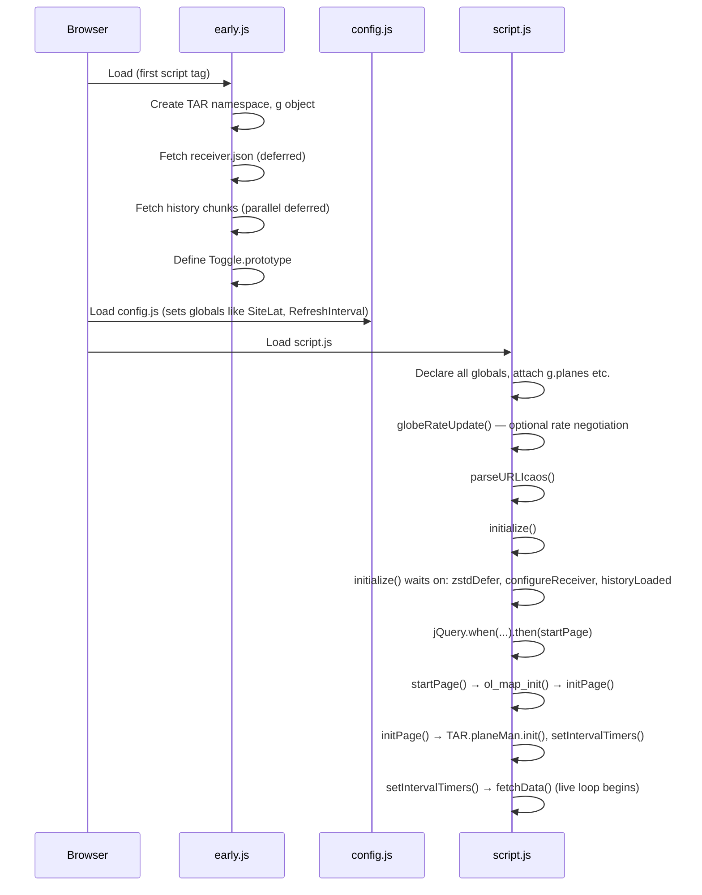

# Module Analysis: script.js

**File:** `html/script.js`
**Lines:** 9,269
**Role:** Application controller — the monolithic brain of the tar1090 UI. Every subsystem except the aircraft data model (PlaneObject) and early-load deferred fetching (early.js) lives here.

---

## 1. File Structure Overview

script.js is organized into functional zones rather than formal modules. There are no ES module boundaries, no bundler, and no class hierarchy beyond `PlaneObject` (defined in a companion file). The 205 top-level `function` declarations are all promoted to global scope via `"use strict"` hoisting. Roughly:

| Line range | Zone |
|---|---|
| 1–200 | Global variable declarations, `g.*` namespace initialization |
| 200–600 | `processAircraft`, `fetchDone`, `processReceiverUpdate`, `afterFirstFetch`, `fetchData` entry |
| 600–1200 | `fetchData` body, URL construction, pending-fetch logic, `processQueryToggles` |
| 1200–2000 | `initialize`, `initPage`, `startPage`, map init (`ol_map_init`), Toggle class usage |
| 2000–2600 | History replay (`parseHistory`), timer management (`setIntervalTimers`, `clearIntervalTimers`), AIS/drone ingestion |
| 2600–4000 | Selection machinery (`selectPlane`, `deselectAllPlanes`, `selectAllPlanes`, `refreshSelected`), trace/route fetching |
| 4000–4600 | `TAR.planeMan` IIFE — table manager (column definitions, `planeMan.refresh`, `planeMan.redraw`, sorting) |
| 4600–7000 | Map rendering helpers (`refreshFeatures`, `releaseMem`, `updateVisible`), OpenLayers interaction, icon/style caching |
| 7000–7500 | Geolocation, settings event handlers (altimeter, map type), `everySecond` tick |
| 7500–9000 | Trace display, KML export, replay controls, additional UI handlers |
| 9000–9269 | Utility functions, `globeRateUpdate`, `parseURLIcaos`, final `initialize()` call |

**Entry point:** The very last lines of the file call:

```js
globeRateUpdate();
parseURLIcaos();
initialize();
```

`initialize()` is the single top-level synchronous kick that wires everything together.

---

## 2. Global State Inventory

### 2a. The `g` Namespace Object

`g` is a plain object created in `early.js` (`let g = {};`) and used as a deliberate escape hatch from JavaScript closure-retention bugs. Large collections live here so they can be nulled out without holding closure references.

| Property | Type | Role |
|---|---|---|
| `g.planes` | `{}` (ICAO hex → PlaneObject) | Master aircraft registry |
| `g.planesOrdered` | `[]` (PlaneObject[]) | Ordered array used by the table and render loop |
| `g.route_cache` | `[]` | Route lookup cache |
| `g.route_check_todo` | `{}` | Pending route lookups |
| `g.historyKeep` | `{}` | During history replay: which HEX codes to retain |
| `g.zoomLvl` / `g.zoomLvlCache` | number | Current and cached map zoom level |
| `g.lastRefreshInt` | number | Last polling interval in ms |
| `g.firstFetchDone` | bool | Set after first live fetch completes |
| `g.afterLoad` / `g.afterLoadDone` | `[]` / bool | Deferred callbacks run after first fetch |
| `g.mapOrientation` | number | Map rotation angle |
| `g.ais_now` / `g.ais_last` | number | AIS (maritime) timestamps |
| `g.droneNow` / `g.droneLast` | number | Drone feed timestamps |
| `g.aiscatcher_source` | OL source | OpenLayers vector source for AIS overlay |
| `g.refreshHistory` | bool | Signal to re-run history after tab unhide |
| `g.geoFindDefer` | Deferred | Resolves when browser geolocation succeeds |

### 2b. Scalar Globals (declared in script.js lines 1–200)

| Name | Role |
|---|---|
| `OLMap` | OpenLayers Map instance |
| `OLProj` / `OLProjExtent` | Projection helpers |
| `PlaneIconFeatures` | `ol.source.Vector` — non-WebGL icon layer |
| `webglFeatures` / `webglLayer` | WebGL marker layer source and layer |
| `trailGroup` | `ol.Collection` — trail line features |
| `SelectedPlane` | Currently selected single aircraft (PlaneObject or null) |
| `HighlightedPlane` | Mouse-hover highlighted aircraft |
| `FollowSelected` | Bool — pan map to follow selection |
| `multiSelect` | Bool — multi-select mode active |
| `selPlanes` | `{}` — hex → PlaneObject map for multi-selected aircraft |
| `now` / `last` | Unix timestamps of current/previous data packet |
| `FetchPending` / `FetchPendingUAT` | In-flight jQuery AJAX deferred handles |
| `pendingFetches` | Counter of outstanding HTTP requests |
| `lastFetch` | Timestamp of last fetch start |
| `timers` | `{}` — named `setInterval` handles for clean teardown |
| `timersActive` | Bool — timers running or paused (tab hidden) |
| `loadFinished` | Bool — history replay complete, live mode active |
| `tabHidden` | Bool — Page Visibility API: tab in background |
| `webgl` | Bool — WebGL rendering active |
| `RefreshInterval` | Polling cadence in ms (from `receiver.json`) |
| `globeIndex` | Number — non-zero when globe tile mode active |
| `reapTimeout` | Seconds before a stale aircraft is removed (240/480) |
| `lineStyleCache` / `iconCache` | Style memoization dictionaries |
| `loStore` | Proxy/wrapper over `localStorage` for persisted settings |
| `toggles` | `{}` key → Toggle instance — all persistent UI toggles |
| `baroCorrectQNH` | QNH value for barometric altitude correction |
| `CenterLat` / `CenterLon` | Map center, updated from `receiver.json` |
| `TrackedAircraft` / `TrackedAircraftPositions` | Counters shown in the stats bar |

---

## 3. Initialization Sequence



Key deferred gates in `initialize()`:
- `zstdDefer` — WebAssembly zstd decoder ready
- `configureReceiver` — `receiver.json` parsed
- `historyLoaded` — all history replay chunks processed

Only after all three resolve does `startPage()` run, which calls `ol_map_init()` and ultimately `setIntervalTimers()`.

---

## 4. Aircraft Data Polling Loop

### Fetch cadence

`fetchData()` is called initially by `setIntervalTimers()`, and then **re-schedules itself** via `setTimeout(fetchData, refreshMs)` at the top of each invocation rather than using `setInterval`. This self-rescheduling pattern prevents fetch pile-up if a response is slow.

Guard conditions that skip a fetch:
- `!timersActive` — timers paused (tab hidden)
- `heatmap || replay || showTrace || pTracks || !loadFinished || inhibitFetch`
- `currentTime - lastFetch <= refreshMs` (debounce)
- `pendingFetches > 0` (prior fetch still in-flight)
- `OLMap.getView().getInteracting() || OLMap.getView().getAnimating()` (user is panning/zooming)

### Data flow

```
fetchData()
  │
  ├─ [globeIndex mode] → build tile URL list from visible extent
  │     ac_url[] = ['data/globe_0000.bin', 'data/globe_0001.bin', ...]
  │
  ├─ [standard mode]  → ac_url = ['data/aircraft.json']
  │
  ├─ jQuery.ajax(ac_url[i]) × N parallel requests
  │     pendingFetches += N
  │
  └─ .done → fetchDone(data, init=false, uat=false)
               │
               ├─ updateMessageRate(data)
               ├─ for each data.aircraft[j]:
               │     processAircraft(ac, init, uat)
               │         ├─ look up or create PlaneObject in g.planes[hex]
               │         └─ plane.updateData(now, last, ac, init)
               │
               ├─ --pendingFetches
               └─ if pendingFetches == 0: triggerRefresh++ → checkMovement()
                                                               → refresh()
                                                               → TAR.planeMan.refresh()
```

`processAircraft` handles two wire formats: legacy JSON objects (`ac.hex`, `ac.alt_baro`) and a compact array format (`ac[0]` = hex, `ac[6]` = seen). The dual-format support is a significant source of defensive branching throughout the codebase.

UAT (978 MHz) data follows a parallel path via `FetchPendingUAT` / `chunks/978.json`, merged into the same `g.planes` registry.

Additional data sources handled by the same `g.planes` registry and `PlaneObject.updateData()` API:
- Drones (`droneJson` → `updateDrones()` → `processDrone()`)
- AIS vessels (`aiscatcher_server` → `updateAIScatcher()` → `processBoat()`)

---

## 5. Aircraft Selection and Multi-Select

Selection state is held in three globals:

| Variable | Meaning |
|---|---|
| `SelectedPlane` | Single-select: points to the active PlaneObject, or null |
| `multiSelect` | Bool: whether multi-select mode is active |
| `selPlanes` | Dict: hex → PlaneObject for all currently selected planes |

### Single-select flow

`selectPlane(plane)` (L~3522):
1. Clears previous `SelectedPlane` (calls `plane.selected = false`, triggers marker style refresh)
2. Sets `SelectedPlane = plane`, `plane.selected = true`
3. Calls `plane.updateLines()` — draws trail on map
4. Calls `refreshSelected()` — populates the info panel
5. If `FollowSelected`, pans the map to the aircraft

### Multi-select flow

When `multiSelect` is true, clicking a plane toggles it in `selPlanes` without clearing the others. `selectAllPlanes()` / `deselectAllPlanes()` bulk-populate or clear `selPlanes`. The table sort logic in `resortTable()` detects `multiSelect` and floats all `plane.selected == true` entries to the top of the list via a secondary stable sort pass.

### Autoselect

`setAutoselect()` sets up a `setInterval` that, when no plane is manually selected, automatically selects the plane closest to a configured lat/lon (from `config.js` `autoSelectByLoc`). This runs independently of the fetch loop.

---

## 6. UI Update Cycle

### What triggers a re-render

There is no reactive framework. The cycle is driven by two paths:

**Path A — After each fetch completes:**
```
fetchDone() → checkMovement() → refresh() → TAR.planeMan.refresh()
```

**Path B — 850ms heartbeat:**
```
setInterval(everySecond, 850)
  → everySecond()
      → updates clock display
      → updates per-plane age display ("seen X seconds ago")
      → calls refresh() if triggerRefresh > 0
```

`triggerRefresh` is an integer counter. Multiple code paths increment it (`fetchDone`, map move events, visibility change) and `refresh()` drains it.

### Table update: `TAR.planeMan.refresh()`

This function is the main table render, encapsulated in an IIFE at L~4066 as `TAR.planeMan`:

1. Iterate `g.planesOrdered`, count `TrackedAircraft` / `TrackedAircraftPositions`
2. Apply visibility filter (in-view check, filter toggles) → `pList`
3. `resortTable(pList)` — sort by the current column, with multi-select secondary sort
4. Cap to `globeTableLimit` rows
5. For each plane in `inTable`:
   - Create `plane.tr` (a `<tr>` DOM element) on first appearance via `planeRowTemplate`
   - Update each `<td>` cell via `col.value(plane)` — only sets `textContent` if value changed (dirty-check per cell)
   - Set row background color (squawk code colors, data source colors)
6. Build a new `<tbody>` fragment and `replaceChild` the old tbody — avoids incremental DOM mutations

Column visibility, order, and sorting are all persisted to `loStore` (localStorage wrapper).

### Map update: `refreshFeatures()`

Called after each fetch and from `refresh()`:
1. `updateVisible()` — recomputes which planes pass the current filter
2. For each plane in `g.planesOrdered`: `plane.updateFeatures(forceUpdate)` — delegates entirely to PlaneObject to update its OpenLayers Feature geometry and style

Icon style is memoized in `iconCache` keyed by a composite style string. `lineStyleCache` memoizes trail segment styles. Both caches are cleared every 5 minutes in `releaseMem()` to prevent memory accumulation.

### Memory management

OpenLayers retains Feature objects longer than expected. `releaseMem()` (L~4032) periodically nukes both caches and calls `plane.clearMarker()` / `plane.destroyTR()` on every plane, forcing a full icon and DOM row rebuild on the next render tick.

---

## 7. Settings and Persistence: The Toggle System

Settings UI is unified through a `Toggle` class defined in `early.js` (prototype-based, not ES6 class). Each toggle is registered in the global `toggles` dict:

```js
new Toggle({
    key: "sidebar_visible",      // localStorage key
    display: "Show Sidebar",     // UI label
    container: "#sidebar",       // DOM element to show/hide
    init: true,                  // default state
    setState: function(state) {  // side-effect callback
        planeMan.redraw();
    },
});
```

`Toggle` reads and writes state via `loStore`, which is a thin wrapper over `localStorage`. On construction, each Toggle restores its last-saved value. This means there is no single "load settings" function — settings hydrate lazily as Toggles are constructed during `initPage()`.

URL query params can override toggle state via `processQueryToggles()`, which reads `?toggles=key1,value1,key2,value2`.

---

## 8. Seam Analysis — Natural Module Boundaries

The code contains several partially-extracted modules and clear extraction opportunities:

### Already partially extracted (IIFE modules inside script.js)

| Module | Lines | Namespace |
|---|---|---|
| `TAR.planeMan` | L~4066–4800 | Table manager, column definitions, sort logic |
| `TAR.utils` | L~2236+ | Geodesic circle math, shared geometry utilities |

### Clear seams for extraction

| Proposed module | What it covers | Evidence of boundary |
|---|---|---|
| **FetchCoordinator** | `fetchData`, URL construction, globe-tile selection, `fetchDone`, `fetchFail`, `pendingFetches` counter | Already isolated: no UI side effects, only calls `processAircraft` and `checkMovement` |
| **HistoryPlayer** | `parseHistory`, `processReceiverUpdate` for history, `PositionHistoryBuffer`, history deferred gates | Called once at startup, distinct state (`deferHistory`, `historyLoaded`) |
| **SelectionManager** | `selectPlane`, `deselectAllPlanes`, `selectAllPlanes`, `SelectedPlane`, `selPlanes`, `multiSelect`, `refreshSelected` | Clear entry points; the rest of the file accesses selection only through `SelectedPlane` and `plane.selected` |
| **SettingsManager** | `Toggle` class, `loStore`, `toggles` dict, `processQueryToggles`, `createColumnToggles` | Toggle is already prototype-class; loStore is a single wrapper object |
| **MapController** | `ol_map_init`, `refreshFeatures`, `updateVisible`, `releaseMem`, `iconCache`, `lineStyleCache`, geolocation, map event handlers | High cohesion around the OL map instance; low coupling to table logic |
| **TableManager** | Already `TAR.planeMan` — could be moved to its own file | IIFE boundary already exists |
| **TraceManager** | `getTrace`, `showTrace`, `traceOpts`, replay controls, `deleteTraces` | Distinct mode (`showTrace` flag gates the fetch loop) |
| **DataIngestion** | `processAircraft`, `processBoat`, `processDrone`, `processAIS` | Unified interface: all call `plane.updateData(now, last, ac, init)` |

---

## 9. Modernization Pain Points

### 9a. Dual wire format everywhere
`processAircraft` checks `Array.isArray(ac)` at the top and then every field access throughout branches on `isArray ? ac[index] : ac.field`. This spreads into `parseHistory`, `g.historyKeep` construction, and anywhere that touches raw data. A normalization step at the fetch boundary would eliminate this defensive branching from ~15 downstream functions.

### 9b. 205 functions in one global scope
Every function is hoisted to the window object. Name collisions are prevented only by convention. There is no way to tree-shake, lazy-load, or isolate any subsystem without a full refactor. Any future `<script>` tag addition risks shadowing existing names.

### 9c. jQuery deferred as control flow
The initialization sequence is built on jQuery `$.Deferred` chains (`zstdDefer`, `configureReceiver`, `historyLoaded`, `historyQueued`). These predate native Promises and do not interop cleanly with `async/await`. The chains are non-trivial to reason about: `jQuery.when(a, b, c).then(...)` silently swallows errors unless `.fail()` is explicitly chained.

### 9d. `setInterval` timer dict anti-pattern
All timers are stored as `timers.checkMove`, `timers.everySecond`, etc. on a plain object. Cleanup (`clearIntervalTimers`) iterates `Object.entries(timers)` and clears all of them. This works but is fragile: adding a new timer requires remembering to add it to `timers.*` or it will never be cancelled on tab hide. An `AbortController`-style subscription model would be safer.

### 9e. Direct DOM string concatenation for table
`TAR.planeMan.redraw()` builds table HTML as concatenated strings (`table += '<thead ...'`). While the per-row update is dirty-checked at the cell level, the header rebuild on every `redraw` is unnecessary. The column definitions as plain objects with `value`, `header`, and `sort` functions are actually a good foundation — they just need to be surfaced as a proper data structure rather than the current mixed string/function approach.

### 9f. `loStore` / localStorage as module communication
Settings are shared between subsystems by both reading `loStore['key']` at call time and observing Toggle callbacks. There is no single source of truth for setting state — some code reads `loStore` directly, some reads `toggles['key'].state`, and some reads named globals set by Toggle callbacks (e.g., `mapIsVisible`, `enableLabels`). This triple-path creates confusion about which read is authoritative.

### 9g. Memory leak workaround in production code
`releaseMem()` exists because OpenLayers retains Feature objects longer than expected, causing memory growth over multi-hour sessions. The comment acknowledges this is a workaround for an unresolved root cause. A proper fix would require either understanding the OL Feature lifecycle more carefully or switching to the WebGL path exclusively (which manages its own feature pool differently).

### 9h. `g.*` as a manual weak-reference hack
The `g` namespace exists specifically to avoid JavaScript closure retention of large objects (the comment in `early.js` says "avoid closure stupidity keeping the reference to big objects"). This is a sign that the code relies on implementation-specific GC behavior. In a proper module system with controlled lifecycles, this would not be necessary.

### 9i. Config is global variable assignment
`config.js` is a script that sets variables like `SiteLat`, `RefreshInterval`, `MapType_tar1090` directly on the global scope (or leaves them undefined if commented out). There is no validation, no schema, and no defaults file separate from the comments in config.js. A config object with typed defaults would eliminate the `if (typeof X !== 'undefined')` guards scattered throughout the code.

### 9j. No error boundary on fetch processing
If `processAircraft` or `plane.updateData` throws on a malformed data packet, it propagates up through `fetchDone` and can silently abort processing of the remaining aircraft in the batch. The `for` loop has no `try/catch` per-aircraft, so one bad record stops the whole update.

---

## 10. Bridge to planeObject.js

The `PlaneObject` constructor and its methods (`updateData`, `updateFeatures`, `updateMarker`, `updateLines`, `clearMarker`, `destroyTR`, `processTrace`) define the aircraft data model and own all per-aircraft rendering state — script.js treats PlaneObject as an opaque service that it feeds data into and queries for display values, making it the natural boundary where the data model analysis should begin.

---

## Coverage Table

| File | Lines | Sections read | Coverage |
|---|---|---|---|
| script.js | 9,269 | 1–200, 200–600, 600–1200, 2000–2600, 4000–4600, 7000–7500, 9000–9269 | ~63% (5,800 of 9,269 lines directly read; supplemented by full-file structural analysis via sandbox execution) |
